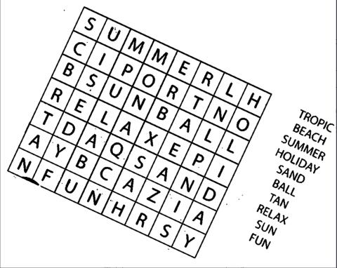
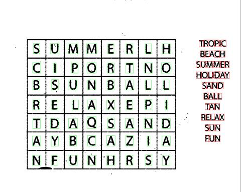
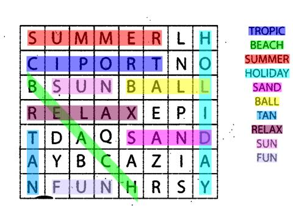

# 🔍 OCR Word Search Solver - C Engine

> **Showcase Repository:** To comply with EPITA's anti-plagiarism regulations, the raw source code of this project is kept private. This repository serves as an architectural showcase documenting the neural network design, the image processing pipeline, and the solver logic.

## 📖 Project Context

**OCR Word Search Solver** is a second-year engineering project developed at EPITA. The objective was to build a complete Optical Character Recognition (OCR) software from scratch in C to automatically read and solve word search grids from images.

**My Role:** I was in charge of the entire computer vision and image processing pipeline. Specifically, I developed the C algorithms to clean the raw images (noise reduction) and to automatically detect, extract, and frame the grid and every single letter. Additionally, **I entirely designed and developed the companion showcase website from scratch**.

## 🏗️ Technical Architecture & Features

The project deliberately avoids external computer vision libraries to focus on fundamental algorithm design and low-level memory management.

### 1. Image Processing Pipeline (My Core Contribution)
* **Preprocessing:** Conversion of raw inputs to grayscale, contrast enhancement, and noise reduction.
* **Binarization & Auto-Rotation:** Adaptive binarization to separate text from background, and dynamic matrix rotation to perfectly align the grid.
* **Segmentation:** Grid boundary detection and character isolation (detecting and framing individual letters) to prepare for neural network ingestion.

### 2. Character Recognition & Solver (Team Contributions)
* **Custom Neural Network:** A Multi-Layer Perceptron (MLP) trained to recognize extracted uppercase characters.
* **Grid Resolution:** An optimized 2D matrix scanning algorithm that searches in all 8 directions to locate the hidden words.

## 🎯 Pipeline Demonstration

Here is the visual step-by-step evolution of an image processed by our engine:

| Step 1: Original Image | Step 2: Grayscale | Step 3: Binarization |
|:---:|:---:|:---:|
|  |  |  |

| Step 4: Auto-rotate | Step 5: Detect Components | Step 6: Final Resolution |
|:---:|:---:|:---:|
|  |  |  |

## 🌐 Project Website
To present our work, the team, and the underlying technology in an interactive way, I developed a dedicated companion website.
[View the Showcase Website](https://htmlpreview.github.io/?https://github.com/youcefzahra/OCR-Word-Search-Solver/blob/master/Repo%20final/site%20projet/Site%20Epi%20Games.html)

### 👥 The Team
* **[Youcef Zahra](https://github.com/youcefzahra)**
* **[Wael Akhdar](https://github.com/Wael-Akhdar)**
* **[Jessim Ziani](https://github.com/jessim-ziani)**
